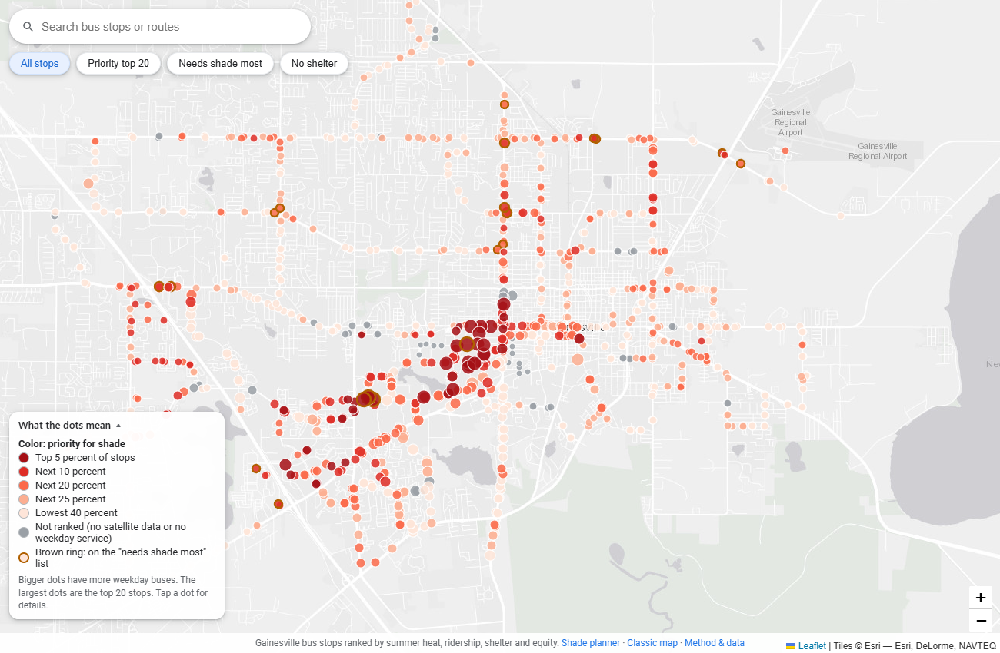

# ShadeMap Gainesville

Riders of Gainesville's RTS buses wait for the bus on unshaded asphalt through Florida summers, and the people who wait the longest are the ones without a car. Nobody has a ranked, data-backed list of which stops are hottest, so ShadeMap builds one from NASA Landsat satellite temperatures, bus schedules, shelter data, and census data.

**Live map:** https://jonathankash.github.io/ShadeMap/ (tap any stop for details)



## What the map shows

Every RTS bus stop is a dot. Darker red and bigger means higher priority for shade. The 20 highest-priority stops are numbered. Stops with no satellite data or no weekday service are gray and are not ranked.

The full ranking is in [`outputs/scored_stops.csv`](outputs/scored_stops.csv) and the top 20 are in [`outputs/top_20_stops.csv`](outputs/top_20_stops.csv).

| Rank | Stop | Bus visits per weekday | Nearby summer morning heat | Shelter (OpenStreetMap) |
|---|---|---|---|---|
| 1 | University Village South Apartments | 163 | 107.9 F | none |
| 2 | Weimer Hall | 248 | 110.7 F | none |
| 3 | Southwest Recreation Center | 61 | 109.3 F | none |
| 4 | Gator Corner Dining Facility @ Gale Lemerand | 248 | 109.6 F | none |
| 5 | Southwest Recreation Center | 61 | 108.2 F | none |

The top 20 is concentrated around the University of Florida campus. That is what the formula produces: campus stops combine hot surroundings with some of the busiest service in the system, and many have no shelter mapped. It is not the result of hand tuning.

## How a stop is scored

A stop ranks higher when it is hotter than most stops, gets more bus visits, has no known shelter, and sits in a census tract where more households have no vehicle:

```
score = heat_percentile * log(1 + daily_trips) * shelter_multiplier * transit_dependence
```

| Term | Meaning |
|---|---|
| `heat_percentile` | Percentile rank (0 to 1) of the average land surface temperature within 100 m of the stop, among all ranked stops. |
| `daily_trips` | Bus visits to the stop on a typical weekday. Used as a stand-in for how many people wait there. |
| `shelter_multiplier` | 1.5 if OpenStreetMap says no shelter, 1.25 if unknown, 1.0 if sheltered. |
| `transit_dependence` | The tract's share of households with no vehicle, scaled to 0.5 (lowest in the county) through 1.5 (highest). Stops with no census value get 1.0. |

There is no model, and the weights were not adjusted to change the ranking.

## Method

1. **Heat (NASA Landsat).** Land surface temperature comes from Landsat 8 and 9 Collection 2 Level-2 (`lwir11` band, 30 m resolution), fetched from the [Microsoft Planetary Computer](https://planetarycomputer.microsoft.com/dataset/landsat-c2-l2) STAC API with no manual downloads. We used 37 scenes from June 2 to September 15, 2026 over Alachua County. Each pixel is cloud-masked individually using the `qa_pixel` band, then the median across all scenes is taken. The USGS scale factor (0.00341802) and offset (149.0) convert to Kelvin, then to Celsius. Each stop gets a 100 m buffer (built in EPSG:6440, Florida North, meters), and we take the mean of the pixels inside it. The county-wide median of the composite is 33.2 C.
2. **Stops and service.** Stop locations and weekday bus visits come from the RTS GTFS feed (Spring 2026, 971 stops), using Wednesday, February 11, 2026 as the representative weekday.
3. **Shelters.** OpenStreetMap via the Overpass API. Each stop takes the nearest OSM bus stop or platform within 25 m. `shelter=yes` is sheltered, `shelter=no` is none, and everything else is unknown.
4. **Transit dependence.** ACS 2024 5-year estimates at census tract level: households with no vehicle (table B08201) and residents 65 and older (table B01001, shown in the data but not used in the score). Numbers come from Census Reporter, a keyless mirror of the same ACS tables. Tract shapes are Census TIGER/Line 2024.
5. **Scoring and map.** `src/score.py` joins the tables and computes the score. `src/make_map.py` builds the static map in `docs/index.html`.

**Result counts:** 971 stops, 915 ranked, 42 excluded for no satellite data, 14 excluded for no weekday service.

### Methods and curriculum

This project follows the NASA GeoEmerge (EMERGE) Data Analysis workflow: acquire public environmental data, clean it (per-pixel cloud masking), analyze it (zonal statistics and ranking), and communicate it to a non-expert audience through a map.

**TODO before submitting:** name the specific EMERGE curriculum textbook and lesson this follows, with a link. The lesson name is not in the repo yet.

## How to run it

Python 3.11 or newer.

```
python -m venv .venv
.venv/Scripts/pip install -r requirements.txt     # on Mac or Linux: .venv/bin/pip

python src/gtfs.py            # stops and weekday trips
cd src && python context.py && cd ..   # shelters and census
python src/lst.py             # Landsat composite and per-stop temperatures
python src/score.py           # scored_stops.csv and top_20_stops.csv
python src/make_map.py        # docs/index.html
```

Every download is cached in `data/`, so a rerun is fast. The handoff files each step produces are committed in `outputs/`, so you can also run `score.py` and `make_map.py` directly without the earlier steps.

## Limitations

- **Shelter data is partial.** OpenStreetMap coverage of bus shelters is uneven. Of the 971 stops, 370 are unknown and 495 are none. "None" means OpenStreetMap says no shelter, not that we confirmed it on the ground, and unknown is treated as somewhere in between.
- **Bus visits are a ridership proxy.** RTS does not publish per-stop ridership, so we use the number of scheduled bus visits per weekday. The schedule is from the Spring 2026 feed, which ends May 3, 2026. That is the newest feed we found, but it predates this analysis.
- **Morning satellite temperatures, over one summer.** Landsat passes over Gainesville around 10:30 am, so the temperatures underestimate the mid-afternoon peak a rider feels. The ranking is relative across stops, so the ordering still means something, but the Celsius and Fahrenheit values are not afternoon temperatures. The data is a seasonal median, not a single heat wave.
- **30 m pixels blur the stop with its surroundings.** The 100 m buffer is a neighborhood average, not the temperature of the pad the rider stands on.
- **42 stops have no temperature data.** This is not cloud cover. The Landsat surface temperature product has a known gap in its emissivity input over part of west-central Gainesville. We show these stops as gray and do not rank them, rather than scoring them as cool.
- **Census data is tract level.** A tract is a coarse proxy for who actually waits at a given stop.
- **Descriptive only.** The list shows where the data says heat exposure is highest. It is not a recommendation for what any agency should build.

## Repository layout

```
src/lst.py       Landsat fetch, scale, composite, per-stop temperatures
src/gtfs.py      stop parsing and weekday trip counts
src/context.py   OpenStreetMap shelters and census tracts
src/score.py     join, score, rank
src/make_map.py  builds the map
outputs/         handoff CSVs and the final ranked CSVs
docs/            the map (index.html), served by GitHub Pages
assets/          screenshots and photos
```

## Data sources

- Landsat 8 and 9 Collection 2 Level-2 (NASA / USGS), via Microsoft Planetary Computer
- RTS (Regional Transit System, Gainesville) GTFS feed
- OpenStreetMap contributors, via the Overpass API
- U.S. Census Bureau ACS 5-year estimates (via Census Reporter) and TIGER/Line shapes
- Basemap tiles from Esri
